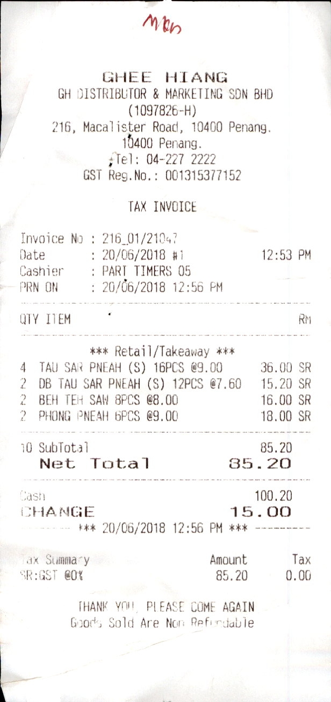

# LAPDoc
Code for the paper [**LAPDoc: Layout-Aware Prompting for Documents**](https://arxiv.org/abs/2402.09841), presented at ICDAR 2024.

- Contains SpatialFormat and SpatialFormatY verbalizer classes which convert OCR Results into a textual representation that aims to restore the original documents layout (see [Example](#Example)).
- Supports multi page documents: page results are concatenated via newline for the final output

## Usage
- To use the package, navigate to root directory and execute 	`pip install -e .`.
- See [demo.py](lapdoc/demo/demo.py) for example usage, demonstrated using two samples of [SROIE](https://arxiv.org/abs/2103.10213).

## Verbalizers
- **LayoutUnawareVerbalizer**  
Joins all OCR texts without incorporation of layout information.
- **SpatialFormatVerbalizer**  
Aims to restore the original document's layout via insertion of spaces and newlines.
- **SpatialFormatYVerbalizer**  
Aims to restore the original document's layout in y-direction via insertion of newlines.
- **BoundingBoxMarkupVerbalizer**  
Converts the OCRBoxes to markup notation in the format:  
`<box left=x0 top=y0 right=x2 bottom=y2/>TEXT`
- **DescriptiveBoundingBoxVerbalizer**  
Converts the OCRBoxes into descriptive notation in the format:  
`left:x0 top:y0 right:x2 bottom:y2 text:'TEXT'`
- **CenterPointVerbalizer**  
Converts the OCRBoxes to markup notation displaying their center point in the format:  
`<box x=(x0+x2)/2 y=(y0+y2)/2/>TEXT`

# Example
<pre>
       GHEE HIANG
       GH DISTRIBUTOR & MARKETING SDN BHD
                  (1097826-H)
      216, MACALISTER ROAD, 10400 PENANG.
                 10400 PENANG.
               TEL: 04-227 2222
           GST REG. NO. : 001315377152

                 TAX INVOICE

 INVOICE NO : 216_01/21047
 DATE       : 20/06/2018 #1            12:53 PM
 CASHIER    : PART TIMERS 05
PRN ON     : 20/06/2018 12:56 PM

 QTY ITEM                                RM

            *** RETAIL/TAKEAWAY ***
 4  TAU SAR PNEAH (S) 16PCS @9.00      36.00 SR
 2  DB TAU SAR PNEAH (S) 12PCS @7.60    15.20 SR
 2  BEH TEH SAW 8PCS @8.00             16.00 SR
 2  PHONG PNEAH 6PCS @9.00             18.00 SR

 10 SUBTOTAL                           85.20
  NET TOTAL       85.20

 CASH                               100.20
 CHANGE           15.00
          *** 20/06/2018 12:56 PM ***

 TAX SUMMARY                  AMOUNT       TAX
 SR:GST @0%                    85.20      0.00

          THANK YOU, PLEASE COME AGAIN
         GOODS SOLD ARE NOT REFUNDABLE
</pre>
was generated from OCR results of this image:
